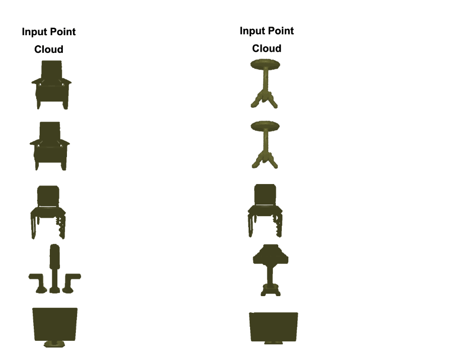

# Analogy-Forming Transformers for Few-Shot 3D Parsing

Official implementation of our [ICLR 2023 paper](https://arxiv.org/abs/2304.14382). By [Nikolaos Gkanatsios](https://github.com/nickgkan), [Mayank Singh](https://github.com/msingh27), [Zhaoyuan Fang](https://github.com/zfang399), [Shubham Tulsiani](http://shubhtuls.github.io/), [Katerina Fragkiadaki](https://www.cs.cmu.edu/~katef/).



## Installation
### Requirements

We showcase the installation for CUDA 11.1 and torch==1.10.2, which is what we used for our experiments.
We were able to reproduce the results with PyTorch 1.12 and CUDA 11.3 as well.
If you need to use a different version, you can try to modify the following instructions accordingly.

- Create environment: `conda create -n analogical python=3.8 anaconda`

- Activate environment: `conda activate analogical`

- Install torch: `pip install -U -f torch==1.10.2 torchvision==0.11.3 --extra-index-url https://download.pytorch.org/whl/cu111`

- Compile the CUDA layers for [PointNet++](http://arxiv.org/abs/1706.02413), which we used in the backbone network: `sh init.sh`

- Other requirements: `pip install -r requirements.txt`

  

For the visualizations we show in the paper, install [PyTorch3D](https://github.com/facebookresearch/pytorch3d/blob/main/INSTALL.md). This step can be skipped if you don't want to run the visualization code. In this case, you need to comment lines 4-14 in src/tools.py.
For CUDA 11.1, follow these steps:

- Install PyTorch3D dependencies: `conda install -c fvcore -c iopath -c conda-forge fvcore iopath`

- Install CUB: `conda install -c bottler nvidiacub`

- Install PyTorch3D: `pip install "git+https://github.com/facebookresearch/pytorch3d.git"`

  

### Data

- [Download PartNet](https://www.shapenet.org/download/parts). We only need ins_seg_h5.zip. Unzip. Then let `PATH_TO_ins_seg_h5` be the path to the unzipped folder `ins_seg_h5/`, found inside ins_seg_h5.zip.

- Clone `https://github.com/daerduoCarey/partnet_dataset` to a path of your choice, let it be `PATH_TO_PARTNET_REPO`.

- Run `python prepare_partnet.py --merging_data_path PATH_TO_PARTNET_REPO/stats/after_merging_label_ids/ --in_path PATH_TO_ins_seg_h5 --out_path PATH_TO_PARTNET`, where `PATH_TO_PARTNET` is the path where processed annotation files are going to be stored (you can define this path).

  

## Usage
### Important paths to define:

- `CHECKPOINT_PATH`: where the trained checkpoints are stored/loaded from. Our code expects that all model/retriever checkpoints are in this folder.

- `FEAT_PATH`: where the pre-computed memory features are going to be stored. This has to take place only once (except if you want to use another retriever later).

- `PATH_TO_PARTNET_REPO`: as defined above, path to the cloned PartNet repository.

- `PATH_TO_PARTNET`: as defined above, path to processed annotation files.

These paths need to specified in every script you run.


### Scripts for each model:

- `./scripts/train_3ddetr.sh`: trains/tests our fully-parametric baseline DETR3D on all levels and classes of PartNet.

- `./scripts/train_analogical_cross.sh`: trains/tests our analogical networks cross-scene. You preferably need a within-scene pre-trained network first. See next script. The retriever can be any checkpoint/model. By default, we use the within-scene pre-trained model.

- `./scripts/train_analogical_within.sh`: within-scene pre-training of our analogical networks.

- `./scripts/train_analogical_multimem.sh`: naive multi-memory model cross-scene training.

- `./scripts/train_multimem_within.sh`: within-scene pre-training of the enhanced multi-memory model.

- `./scripts/train_multimem_cross.sh`: cross-scene training of the enhanced multi-memory model.

- `./scripts/train_re3ddetr.sh`: single-memory Re-DETR3D.

- `./scripts/train_re3ddetr_multimem.sh`: multi-memory Re-DETR3D.

We also include an enhanced version of our multi-memory model that has additional attention layers for each memory point cloud separately. Empirically, it gives somewhat better many-show performance, but similar few-shot performance.


### Evaluate/fine-tune few-shot

- Use `--eval` to evaluate on the validation many-shot set. Check the respective arguments in `main.py` to i) evaluate on another split, ii) evaluate on a specific class/level (the code will show statistics for all classes regardless).

- Use `--k_shot_seed 10` if you want to test few-shot. Specify `--eval_multitask` to the number of different few-shot tasks you want to evaluate on (we use 10 in our experiments).

- Specify `--ft_epoch` to the number of fine-tuning epochs, if you want to fine-tune (we use 90 in our experiments). Note that fine-tuning is optional for the memory-based models.


### Checkpoints
Download all our checkpoints for the above scripts [here](https://drive.google.com/file/d/1HU4znoiWe7Mb3RTPkFnGhEYRoumlZnEp/view?usp=sharing). We do not provide checkpoints for the few-shot experiments, as we run over multiple few-shot seeds. It should be easy to obtain a fine-tuned model for the novel classes within 1-2 hours.


## Citing Analogy-forming Transformers
If you find our work useful in your research, please consider citing:
```bibtex
@article{gkanatsios2023analogical,
  author    = {Gkanatsios, Nikolaos and Singh, Mayank and Fang, Zhaoyuan and Tulsiani, Shubham and Fragkiadaki, Katerina},
  title     = {Analogy-Forming Transformers for Few-Shot 3D Parsing},
  journal   = {ICLR},
  year      = {2023},
}
    
```

